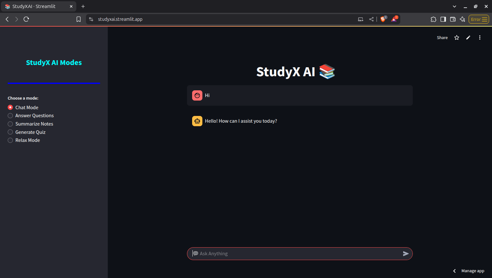
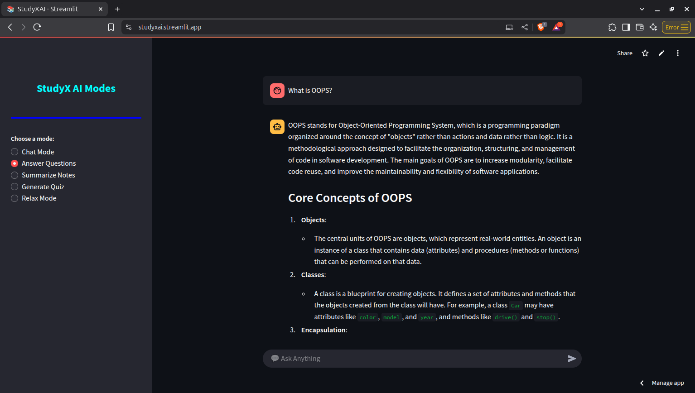
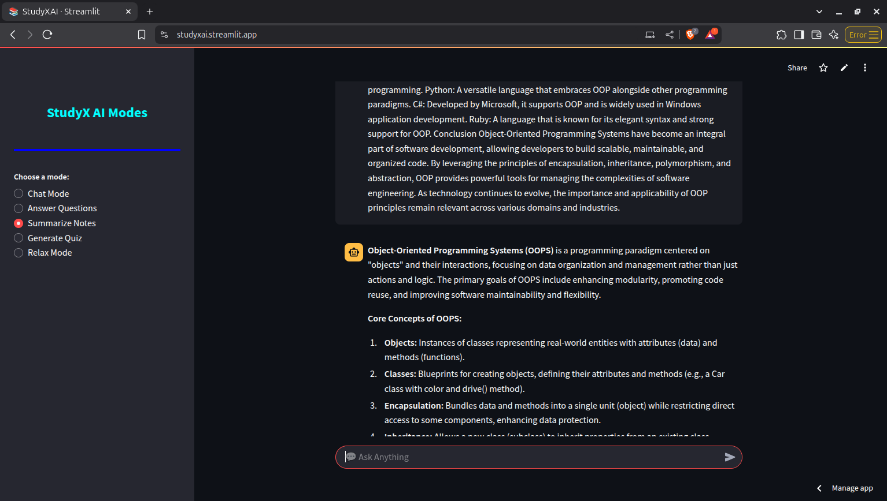
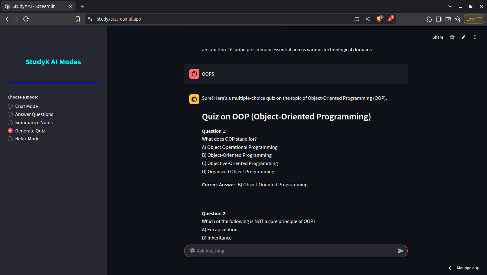

# 📚 StudyX AI

**StudyX AI** is your all-in-one academic companion built with **Streamlit** and **OpenAI's GPT API**. Whether you're looking to chat, get your questions answered, summarize study notes, generate quizzes, or just relax with music — StudyX AI has got you covered.

# Live Demo: https://studyxai.streamlit.app/

---

## ✨ Features

- 💬 **Chat Mode** – General AI chat for study-related or casual queries.
- ❓ **Answer Questions** – Ask subject-specific questions and get detailed answers.
- 📝 **Summarize Notes** – Paste your notes and get a concise summary.
- 🧠 **Generate Quiz** – Generate multiple-choice quizzes on any topic with correct answers.
- 🎵 **Relax Mode** – Unwind with your favorite music using the built-in music player.

---  

## Photos
  
  
  
  
  


---  


## 🚀 Tech Stack

- [Python](https://www.python.org/)
- [Streamlit](https://streamlit.io/)
- [OpenAI GPT-4o](https://platform.openai.com/)
- [Pygame](https://www.pygame.org/) – for music player
- [python-dotenv](https://pypi.org/project/python-dotenv/) – for environment variable management

---

	
<!--
## 🔧 Setup Instructions
You have to create a python virtual environment, for this enter the following commands  
python -m venv venv  
source venv/bin/activate  
THEN PLEASE INSTALL THE FOLLOWING MOUDLES  
pip install streamlit openai python-dotenv pygame   


1. **Clone the repository**
   ```bash
   git clone https://github.com/your-username/studyx-ai.git
   cd studyx-ai
   streamlit run StudyXAI.py
